# Frigg: Multi-Flow Congestion Control with Mean Distribution Information in Bottleneck Link of Heterogeneous Network

## Introduce
The current heterogeneous network environment is complex
and changeable, and the interaction and competition between
flows in the bottleneck link affect the actual throughput. We
expect to explore the impact of data flow information on the
bandwidth utilization of bottleneck links. Further, we propose
a flexible congestion control strategy Frigg, utilizing shared
flow mean distribution information. It learns the strategy according to the shared information from other flows on the
bottleneck link to accurately adjust the congestion window
size for each flow without making changes in the in-network
routing, so that the overall rate matches the pipeline capacity.

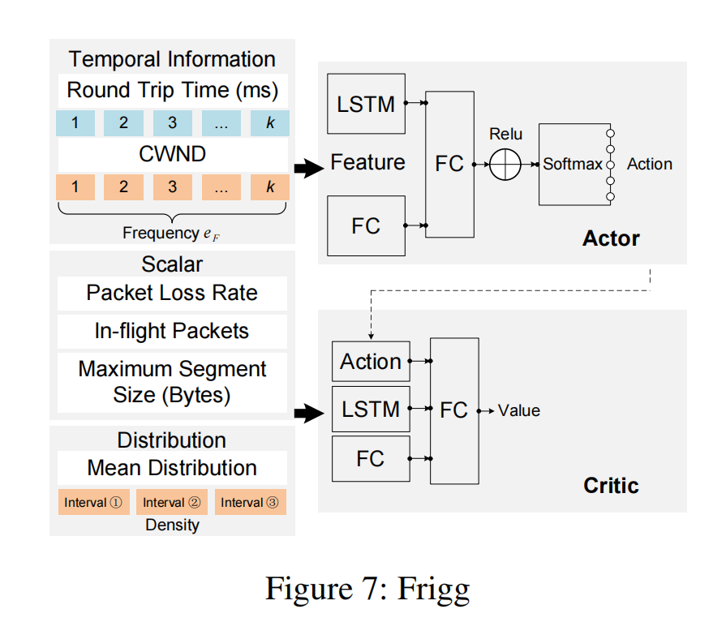

## Test Result

1. draw_train.py -> plot_train
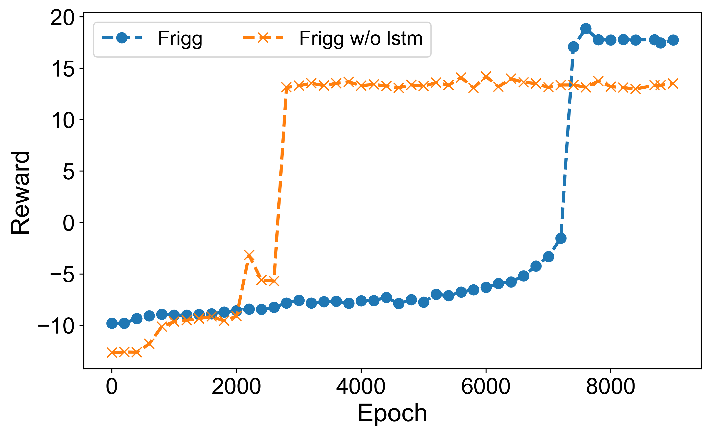

2. draw_compare.py -> plot_compare
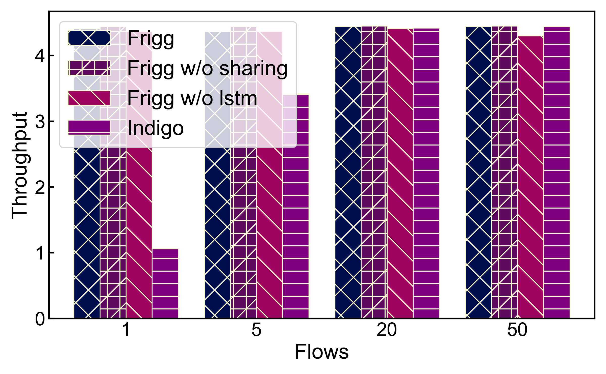
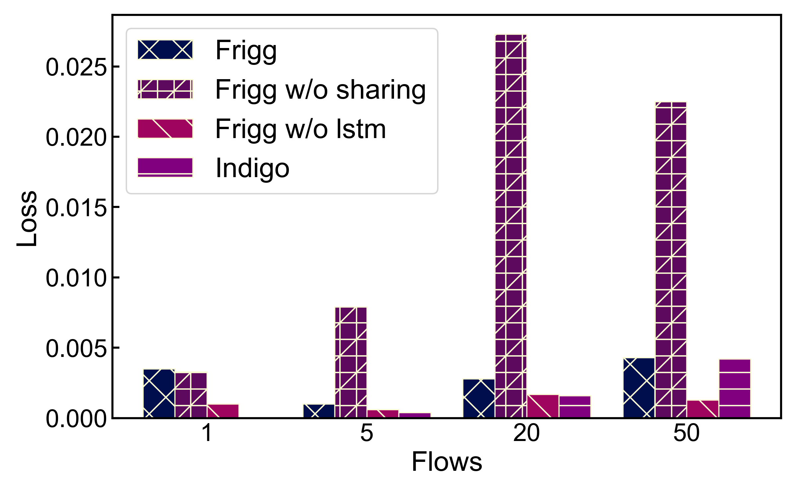
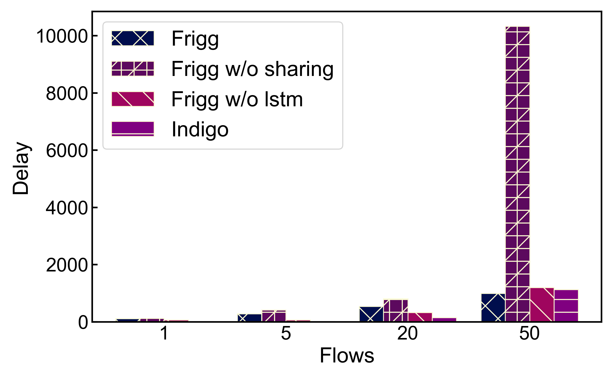
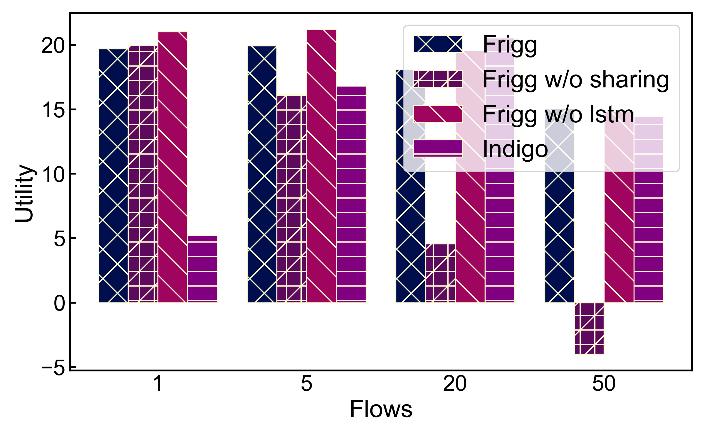

3. draw_detail.py -> plot_detail
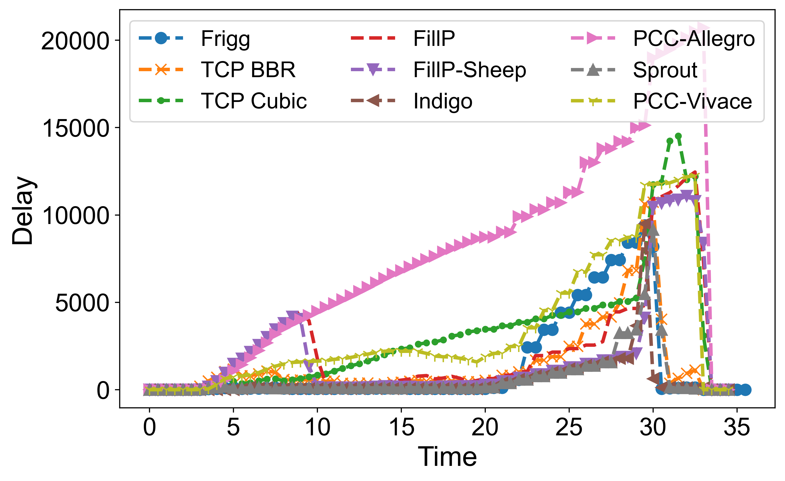
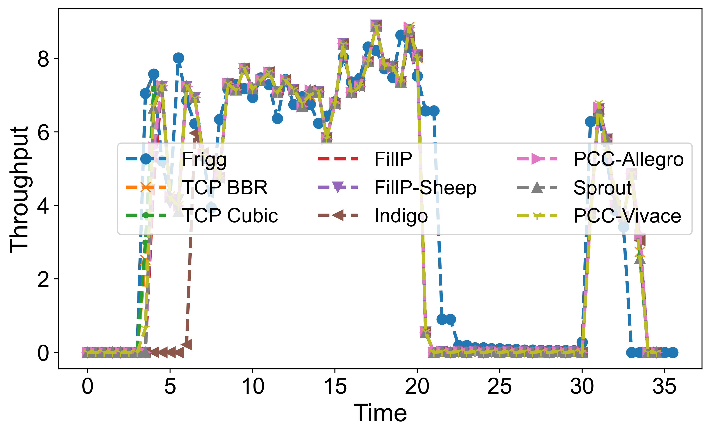
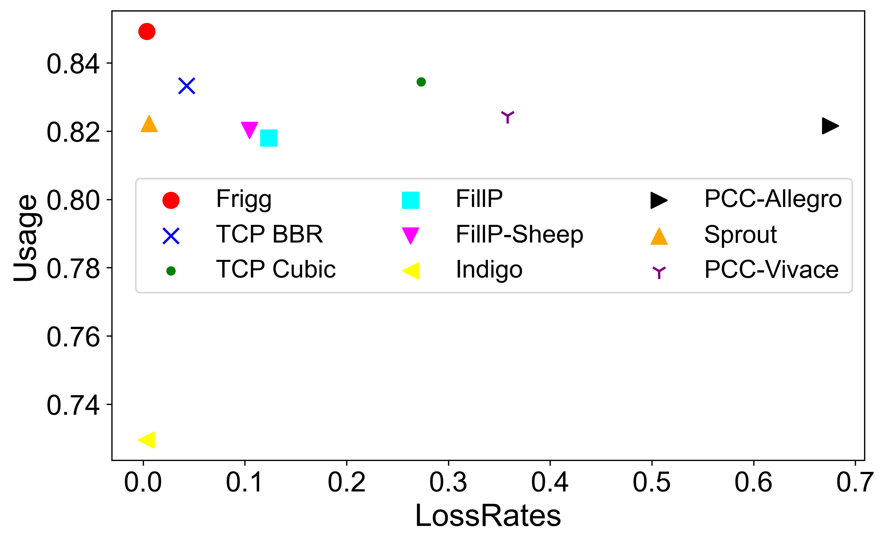
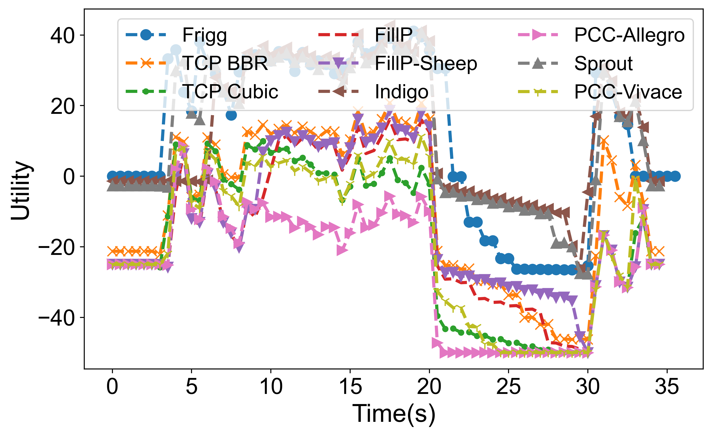
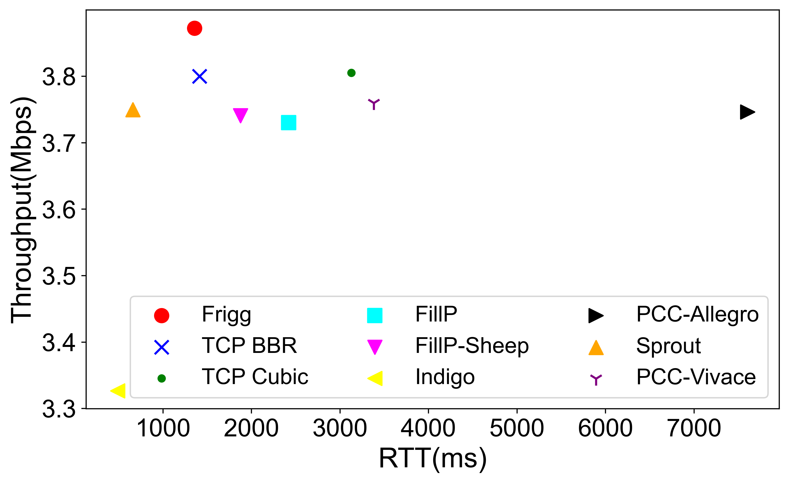

4. draw_interval_start.py -> plot_interval
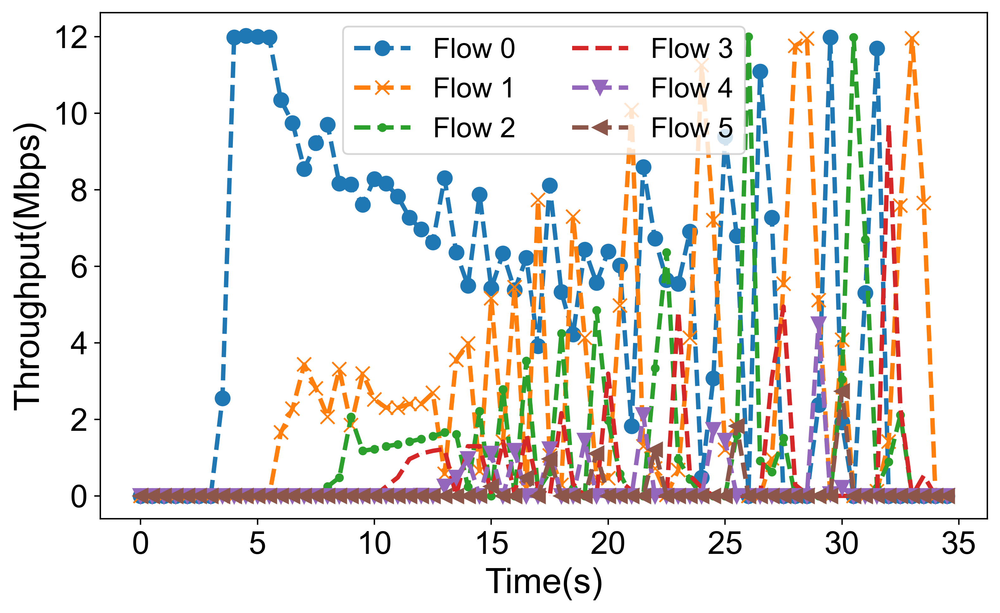
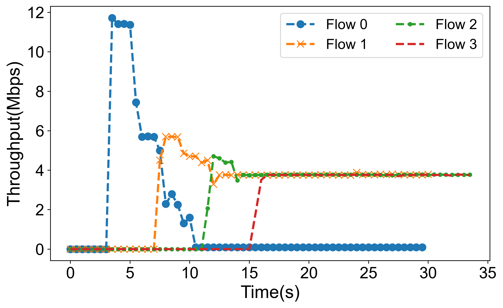

5. pantheon results —— use pantheon origin plot results
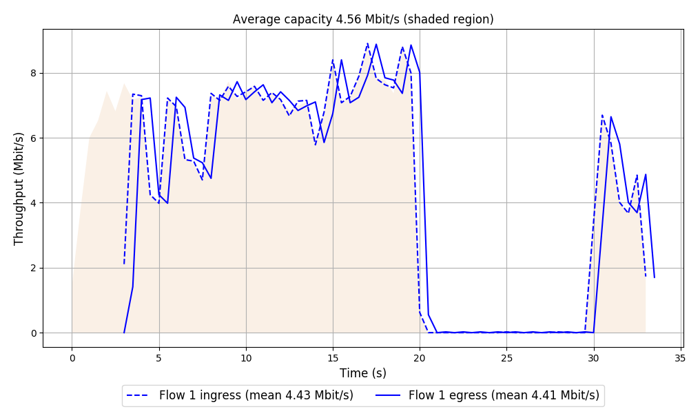